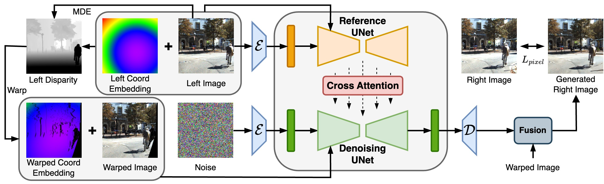

# GenStereo: Towards Open-World Generation of Stereo Images and Unsupervised Matching

This fork adds a CLI with batch processing and tiled diffusion to GenStereo

<div class="is-size-5 publication-authors">
  <span class="author-block">
    <a href="https://qjizhi.github.io/" target="_blank">Feng Qiao</a>,
  </span>
  <span class="author-block">
    <a href="https://steven-xiong.github.io/" target="_blank">Zhexiao Xiong</a>,
  </span>
  <span class="author-block">
    <a href="https://ericx003.github.io/" target="_blank">Eric Xing</a>,
  </span>
  <span class="author-block">
    <a href="https://jacobsn.github.io/" target="_blank">Nathan Jacobs</a>
  </span>
</div>
<div class="is-size-5 publication-authors">
  <span class="author-block">Washington University in St. Louis</span>
</div>


[](https://qjizhi.github.io/genstereo) &nbsp;
[](https://huggingface.co/spaces/FQiao/GenStereo) &nbsp;
[](https://github.com/Qjizhi/GenStereo) &nbsp;
[](https://huggingface.co/FQiao/GenStereo/tree/main) &nbsp;
[](https://arxiv.org/abs/2503.12720)

[Introduction](#introduction)
| [Demo](#demo)
| [How to use](#how-to-use)
| [Citation](#citation)
| [Acknowledgements](#acknowledgements)


## Updates

- **17/03/2025:** Codes and demos are released

## Introduction

This repository is an official implementation for the paper "[GenStereo:  Towards Open-World Generation of Stereo Images and Unsupervised Matching](https://qjizhi.github.io/genstereo/)". Given an arbitrary reference image, GenStereo generates the corresponding right-view image by enforcing constraints at three levels: input (disparity-aware coordinate and warped-image embeddings), feature (cross-view attention), and output (pixel-level loss with adaptive fusion). These constraints yield stereo images with geometric consistency and visual quality. Our methods demonstrate state-of-the-art performance in both stereo image generation and unsupervised stereo matching.



## Demo

Try the demo [here](https://huggingface.co/spaces/FQiao/GenStereo).

## How to use

### Environment

We tested our codes on Ubuntu with nVidia A100 GPU. If you're using other machines like Windows, consider using Docker. You can either add packages to your python environment or use Docker to build an python environment. Commands below are all expected to run in the root directory of the repository.

We tested the environment with python `>=3.10` and CUDA `=11.8`. To add mandatory dependencies run the command below.

``` shell
pip install -r requirements.txt
```

To run developmental codes such as the example provided in jupyter notebook and the live demo implemented by gradio, add extra dependencies via the command below.

``` shell
pip install -r requirements_dev.txt
```

### Clone the repo
Clone the code of GenStereo and Depth Anything V2.
```bash
git clone --recurse-submodules https://github.com/Qjizhi/GenStereo.git
```

### Download pretrained models

GenStereo uses pretrained models which consist of both our finetuned models and publicly available third-party ones. Download all the models to `checkpoints` directory or anywhere of your choice. You can do it manually or by the [download_models.sh](scripts/download_models.sh) script.

#### Download script

``` shell
mkdir checkpoints
bash scripts/download_models.sh 
```

#### Manual download

> [!NOTE]
> Models and checkpoints provided below may be distributed under different licenses. Users are required to check licenses carefully on their behalf.

1. Our finetuned models:
    - For details about each model, check out the [model card](https://huggingface.co/FQiao/GenStereo).
2. Pretrained models:
    - [sd-vae-ft-mse](https://huggingface.co/stabilityai/sd-vae-ft-mse)
      - download `config.json` and `diffusion_pytorch_model.safetensors` to `checkpoints/sd-vae-ft-mse`
    - [sd-image-variations-diffusers](https://huggingface.co/lambdalabs/sd-image-variations-diffusers)
      - download `image_encoder/config.json` and `image_encoder/pytorch_model.bin` to `checkpoints/image_encoder`
3. MDE (Monocular Depth Estimation) models
    - We use [Depth Anything V2](https://github.com/DepthAnything/Depth-Anything-V2) as the MDE model and get the disparity maps.
The final `checkpoints` directory must look like this:

```
.
├── depth_anything_v2_vitl.pth
├── genstereo
│   ├── config.json
│   ├── denoising_unet.pth
│   ├── fusion_layer.pth
│   ├── pose_guider.pth
│   └── reference_unet.pth
├── image_encoder
│   ├── config.json
│   └── pytorch_model.bin
└── sd-vae-ft-mse
    ├── config.json
    └── diffusion_pytorch_model.safetensors
```

### Inference
You can easily run the inference code by running the following command, and the results will be save under `./vis` folder.

```bash
python test.py /path/to/your/image
```


### Gradio live demo

An interactive live demo is also available. Start gradio demo by running the command below, and goto [http://127.0.0.1:7860/](http://127.0.0.1:7860/)
If you are running it on the server, be sure to forward the port 7860.

Or you can just visit [Spaces](https://huggingface.co/spaces/FQiao/GenStereo) hosted by Hugging Face to try it now.

```shell
python app.py
```

## Citation

``` bibtex
  @misc{qiao2025genstereoopenworldgenerationstereo,
    title={GenStereo: Towards Open-World Generation of Stereo Images and Unsupervised Matching},
    author={Feng Qiao and Zhexiao Xiong and Eric Xing and Nathan Jacobs},
    year={2025},
    eprint={2503.12720},
    archivePrefix={arXiv},
    primaryClass={cs.CV},
    url={https://arxiv.org/abs/2503.12720},
  }
```

## Acknowledgements

Our codes are based on [GenWarp](https://github.com/sony/genwarp),  [Moore-AnimateAnyone](https://github.com/MooreThreads/Moore-AnimateAnyone) and other repositories. We thank the authors of relevant repositories and papers.
